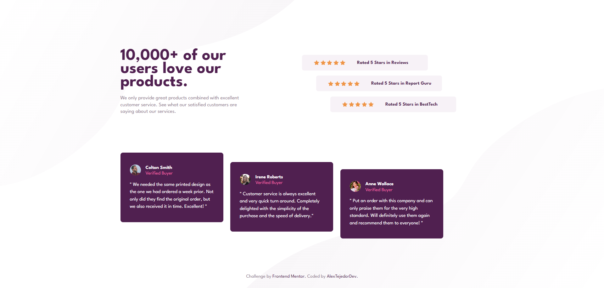

# Frontend Mentor - Social proof section solution

This is a solution to the [Social proof section challenge on Frontend Mentor](https://www.frontendmentor.io/challenges/social-proof-section-6e0qTv_bA). Frontend Mentor challenges help you improve your coding skills by building realistic projects. 

## Table of contents

- [Overview](#overview)
  - [The challenge](#the-challenge)
  - [Screenshot](#screenshot)
  - [Links](#links)
- [My process](#my-process)
  - [Built with](#built-with)
  - [What I learned](#what-i-learned)
  - [Continued development](#continued-development)
  - [Useful resources](#useful-resources)
- [Author](#author)


## Overview

### The challenge

Users should be able to:

- View the optimal layout for the section depending on their device's screen size

### Screenshot



### Links

- Solution URL: [GitHub Repo](https://github.com/AlexanderTejedor/Social-proof-section)
- Live Site URL: [GitHub Pages](https://alexandertejedor.github.io/Social-proof-section/)

## My process

### Built with

- Semantic HTML5 markup
- CSS custom properties
- Flexbox
- CSS Grid
- Mobile-first workflow

### What I learned

In this challenge, I was able to apply the positioning of background images again with the properties I learned from the previous challenge. I'm super proud to keep practicing this type of positioning. It has helped me a lot, and I learned a new property, which is background-size, that helped me scale the image!!!

```css
body{
        height: 100dvh;
        justify-content: center;
        align-items: center;
        background-image: url(./assets/images/bg-pattern-top-desktop.svg), url(./assets/images/bg-pattern-bottom-desktop.svg);
        background-repeat: no-repeat, no-repeat;
        background-position: right 44vw bottom 35vh, left 35vw top 30vh;
        background-size: 1100px 800px, 1300px 800px;
    }
```

### Continued development

I just need to keep practicing and improving my CSS skills!!

### Useful resources

- [Google Fonts](https://fonts.google.com/) - This helped me to use external fonts instead of local ones, so that everyone can identify the type of font I used for this challenge.
- [background-size](https://developer.mozilla.org/es/docs/Web/CSS/background-size) - This resource helped me understand how background-size works:


## Author

- Website - [Alexander Tejedor](https://github.com/AlexanderTejedor)
- Frontend Mentor - [@AlexanderTejedor](https://www.frontendmentor.io/profile/AlexanderTejedor)
- Twitter - [@Alexand59894016](https://x.com/Alexand59894016)
- Instagram - [___.alexDev.___](https://www.instagram.com/___.alexdev.___/)
